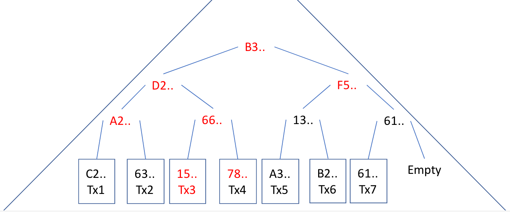

## Merkle tree

From Wikipedia: “A Merkle tree is a tree in which every leaf node is labeled with the cryptographic hash of a data block, and every non-leaf node is labeled with the cryptographic hash of the labels of its child nodes.”

- In the blockchain world, Merkle trees are usually used to verify the existence and validity of transactions in a block.
- Thanks to the tree properties, to prove a specific transaction existence in a block, there's no need to expose the rest of the block transactions, just the content of the transaction itself and the list of *log(N)* hashes.
- Usually, only the Merkle tree root hash is exposed to end-user.

### Merkle tree proof example
Here is an example of proof generation and verification, based on an example tree
- To prove that `Tx3` is part of the block Merkle tree with root **B3..** , we need `Tx3`, its hash – **15..** and **78..** (hash of sibling transaction),  **A2..** (sibling in Merkle tree), and **F5..** (sibling in Merkle tree).
- So, the final proof is {**15..**, **78..**, **A2..**, **F5..**, **B3..**}
- Proof validation: _hash(hash(hash(**15..** || **78..**) || **A2..**) || **F5..**) == **B3..**_

- This is the exact structure we used to prove a specific transaction's existence in a block.
- We store only the Merkle tree root hash as part of the block header and recalculate the tree on demand.

### Orion Merkle tree API

Server side - Merkle tree implementation:

```go
// Node struct keep data for Merkle tree node. For now, it is binary Merkle tree
type Node struct {
...	
}

// BuildTreeForBlockTx builds Merkle tree from block transactions.
// Each data leaf addressed by its index inside block 
func BuildTreeForBlockTx(block *types.Block) (*Node, error)

// Proof calculate intermediate hashes between leaf with given index and root (caller node)
func (n *Node) Proof(leafIndex int) ([][]byte, error) {
    path, err := n.findPath(leafIndex)
    if err != nil {
        return nil, err
}
```

Protobuf's transaction proof message:
```protobuf
message GetTxProofQuery {
  string user_id = 1;
  uint64 block_number = 2;
  uint64 tx_index = 3;
}

message GetTxProofResponse {
  ResponseHeader header = 1;
  repeated bytes hashes = 2;
}
```

SDK side - Transaction proof validation:
```go
type TxProof struct {
	intermediateHashes [][]byte
}

func (p *TxProof) Verify(receipt *types.TxReceipt, tx proto.Message) (bool, error)
```

